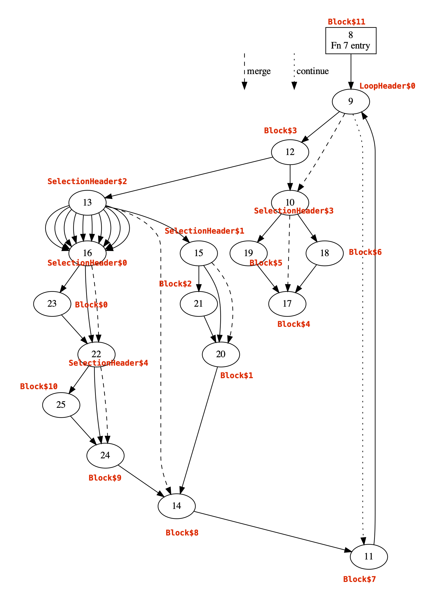

# fleshout.py

This tool encodes a run of a CFG either by choosing a random path (optionally of a given length). The path must end in a terminal block. If a path of certain length is asked for, it may minimally extended to make it terminating.


## Usage

```
usage: fleshout.py [-h] [--l L] [--seed SEED] xml

This tool fleshes out xml CFG skeletons generated by Alloy.

positional arguments:
  xml          The xml CFG skeleton generated by Alloy

optional arguments:
  -h, --help   show this help message and exit
  --l L        This is the suggested maximum length of the randomly chosen path: the path may be
               extended minimally to make it terminating.
  --seed SEED  The seed to use for the PNG. This can be used to reproduce paths. To guarantee
               reproducibility the seed should be paired with the exact same path length argument.
```

## Example

The CFG below is a skeleton from [here](https://github.com/KhronosGroup/VK-GL-CTS/blob/master/external/vulkancts/data/vulkan/amber/graphicsfuzz/stable-binarysearch-tree-fragcoord-less-than-zero.amber).




```
python3.9 fleshout.py test_0.xml --l 24 --seed 6179875240267643350
```
generates..

```
#!amber

SHADER compute compute_shader SPIRV-ASM

; Follow the path:
; 8 -> 9 -> <12> -> <13> -> edge_6 -> <16> -> 23 -> <22> -> 25 -> 24 -> 14 -> 11 -> 9 -> <12> -> <10> -> 19 -> 17
;
; 5 CFG nodes have OpBranchConditional or OpSwitch as their terminators (denoted <n>): 10, 12, 13, 16 and 22.
;
; To follow this path, we need to make these decisions each time we reach 10, 12, 13, 16 or 22.
; This path was generated with the seed 6179875240267643350 and has length 16.
;
; We equip the shader with 5+1 storage buffers:
; - An input storage buffer with the directions for each node 10, 12, 13, 16 or 22
; - An output storage buffer that records the blocks that are executed

; SPIR-V
; Version: 1.3
; Generator: Khronos Glslang Reference Front End; 8
; Bound: 15
; Schema: 0

               OpCapability Shader
               OpMemoryModel Logical GLSL450
               OpEntryPoint GLCompute %7 "main"
               OpExecutionMode %7 LocalSize 1 1 1
               
               ; Below, we declare various types and variables for storage buffers.
               ; These decorations tell SPIR-V that the types and variables relate to storage buffers


               OpDecorate %size_1_struct_type BufferBlock
               OpMemberDecorate %size_1_struct_type 0 Offset 0
               OpDecorate %size_1_array_type ArrayStride 4

               OpDecorate %size_2_struct_type BufferBlock
               OpMemberDecorate %size_2_struct_type 0 Offset 0
               OpDecorate %size_2_array_type ArrayStride 4

               OpDecorate %output_struct_type BufferBlock
               OpMemberDecorate %output_struct_type 0 Offset 0
               OpDecorate %output_array_type ArrayStride 4

               OpDecorate %directions_10_variable DescriptorSet 0
               OpDecorate %directions_10_variable Binding 0

               OpDecorate %directions_12_variable DescriptorSet 0
               OpDecorate %directions_12_variable Binding 1

               OpDecorate %directions_13_variable DescriptorSet 0
               OpDecorate %directions_13_variable Binding 2

               OpDecorate %directions_16_variable DescriptorSet 0
               OpDecorate %directions_16_variable Binding 3

               OpDecorate %directions_22_variable DescriptorSet 0
               OpDecorate %directions_22_variable Binding 4

               OpDecorate %output_variable DescriptorSet 0
               OpDecorate %output_variable Binding 5


          %1 = OpTypeVoid
          %2 = OpTypeFunction %1
          %3 = OpTypeBool
          %4 = OpTypeInt 32 0
          %5 = OpConstantTrue %3
          %6 = OpConstant %4 0
          

               %constant_0 = OpConstant %4 0
               %constant_1 = OpConstant %4 1
               %constant_2 = OpConstant %4 2
               %constant_6 = OpConstant %4 6
               %constant_8 = OpConstant %4 8
               %constant_9 = OpConstant %4 9
               %constant_10 = OpConstant %4 10
               %constant_11 = OpConstant %4 11
               %constant_12 = OpConstant %4 12
               %constant_13 = OpConstant %4 13
               %constant_14 = OpConstant %4 14
               %constant_15 = OpConstant %4 15
               %constant_16 = OpConstant %4 16
               %constant_17 = OpConstant %4 17
               %constant_18 = OpConstant %4 18
               %constant_19 = OpConstant %4 19
               %constant_20 = OpConstant %4 20
               %constant_21 = OpConstant %4 21
               %constant_22 = OpConstant %4 22
               %constant_23 = OpConstant %4 23
               %constant_24 = OpConstant %4 24
               %constant_25 = OpConstant %4 25


               ; Declaration of storage buffers for the 5 directions and the output
               

               %size_1_array_type = OpTypeArray %4 %constant_1
               %size_1_struct_type = OpTypeStruct %size_1_array_type
               %size_1_pointer_type = OpTypePointer Uniform %size_1_struct_type
               %directions_16_variable = OpVariable %size_1_pointer_type Uniform
               %directions_10_variable = OpVariable %size_1_pointer_type Uniform
               %directions_13_variable = OpVariable %size_1_pointer_type Uniform
               %directions_22_variable = OpVariable %size_1_pointer_type Uniform

               %size_2_array_type = OpTypeArray %4 %constant_2
               %size_2_struct_type = OpTypeStruct %size_2_array_type
               %size_2_pointer_type = OpTypePointer Uniform %size_2_struct_type
               %directions_12_variable = OpVariable %size_2_pointer_type Uniform

               %output_array_type = OpTypeArray %4 %constant_16
               %output_struct_type = OpTypeStruct %output_array_type
               %output_pointer_type = OpTypePointer Uniform %output_struct_type
               %output_variable = OpVariable %output_pointer_type Uniform

               ; Pointer type for declaring local variables of int type
               %local_int_ptr = OpTypePointer Function %4

               ; Pointer type for integer data in a storage buffer
               %storage_buffer_int_ptr = OpTypePointer Uniform %4


          %7 = OpFunction %1 None %2

          %8 = OpLabel ; StructurallyReachableBlock$11
               %output_index = OpVariable %local_int_ptr Function %constant_0
               %directions_10_index = OpVariable %local_int_ptr Function %constant_0
               %directions_12_index = OpVariable %local_int_ptr Function %constant_0
               %directions_13_index = OpVariable %local_int_ptr Function %constant_0
               %directions_16_index = OpVariable %local_int_ptr Function %constant_0
               %directions_22_index = OpVariable %local_int_ptr Function %constant_0


   %temp_8_0 = OpLoad %4 %output_index
   %temp_8_1 = OpAccessChain %storage_buffer_int_ptr %output_variable %constant_0 %temp_8_0
               OpStore %temp_8_1 %constant_8
   %temp_8_2 = OpIAdd %4 %temp_8_0 %constant_1
               OpStore %output_index %temp_8_2
               OpBranch %9


          %9 = OpLabel ; LoopHeader$0
   %temp_9_0 = OpLoad %4 %output_index
   %temp_9_1 = OpAccessChain %storage_buffer_int_ptr %output_variable %constant_0 %temp_9_0
               OpStore %temp_9_1 %constant_9
   %temp_9_2 = OpIAdd %4 %temp_9_0 %constant_1
               OpStore %output_index %temp_9_2
               OpLoopMerge %10 %11 None
               OpBranch %12


         %12 = OpLabel ; StructurallyReachableBlock$3
  %temp_12_0 = OpLoad %4 %output_index
  %temp_12_1 = OpAccessChain %storage_buffer_int_ptr %output_variable %constant_0 %temp_12_0
               OpStore %temp_12_1 %constant_12
  %temp_12_2 = OpIAdd %4 %temp_12_0 %constant_1
               OpStore %output_index %temp_12_2
  %temp_12_3 = OpLoad %4 %directions_12_index
  %temp_12_4 = OpAccessChain %storage_buffer_int_ptr %directions_12_variable %constant_0 %temp_12_3
  %temp_12_5 = OpLoad %4 %temp_12_4
  %temp_12_6 = OpIEqual %3 %temp_12_5 %constant_1
  %temp_12_7 = OpIAdd %4 %temp_12_3 %constant_1
               OpStore %directions_12_index %temp_12_7
               OpBranchConditional %temp_12_6 %13 %10


         %13 = OpLabel ; SelectionHeader$2
  %temp_13_0 = OpLoad %4 %output_index
  %temp_13_1 = OpAccessChain %storage_buffer_int_ptr %output_variable %constant_0 %temp_13_0
               OpStore %temp_13_1 %constant_13
  %temp_13_2 = OpIAdd %4 %temp_13_0 %constant_1
               OpStore %output_index %temp_13_2
  %temp_13_3 = OpLoad %4 %directions_13_index
  %temp_13_4 = OpAccessChain %storage_buffer_int_ptr %directions_13_variable %constant_0 %temp_13_3
  %temp_13_5 = OpLoad %4 %temp_13_4
  %temp_13_7 = OpIAdd %4 %temp_13_3 %constant_1
               OpStore %directions_13_index %temp_13_7
               OpSelectionMerge %14 None
               OpSwitch %temp_13_5 %15 1 %16 2 %16 3 %16 4 %16 5 %16 6 %16 7 %16 8 %16 9 %16 10 %16


         %10 = OpLabel ; SelectionHeader$3
  %temp_10_0 = OpLoad %4 %output_index
  %temp_10_1 = OpAccessChain %storage_buffer_int_ptr %output_variable %constant_0 %temp_10_0
               OpStore %temp_10_1 %constant_10
  %temp_10_2 = OpIAdd %4 %temp_10_0 %constant_1
               OpStore %output_index %temp_10_2
  %temp_10_3 = OpLoad %4 %directions_10_index
  %temp_10_4 = OpAccessChain %storage_buffer_int_ptr %directions_10_variable %constant_0 %temp_10_3
  %temp_10_5 = OpLoad %4 %temp_10_4
  %temp_10_6 = OpIEqual %3 %temp_10_5 %constant_1
  %temp_10_7 = OpIAdd %4 %temp_10_3 %constant_1
               OpStore %directions_10_index %temp_10_7
               OpSelectionMerge %17 None
               OpBranchConditional %temp_10_6 %18 %19


         %15 = OpLabel ; SelectionHeader$1
               OpSelectionMerge %20 None
               OpBranchConditional %5 %21 %20


         %16 = OpLabel ; SelectionHeader$0
  %temp_16_0 = OpLoad %4 %output_index
  %temp_16_1 = OpAccessChain %storage_buffer_int_ptr %output_variable %constant_0 %temp_16_0
               OpStore %temp_16_1 %constant_16
  %temp_16_2 = OpIAdd %4 %temp_16_0 %constant_1
               OpStore %output_index %temp_16_2
  %temp_16_3 = OpLoad %4 %directions_16_index
  %temp_16_4 = OpAccessChain %storage_buffer_int_ptr %directions_16_variable %constant_0 %temp_16_3
  %temp_16_5 = OpLoad %4 %temp_16_4
  %temp_16_6 = OpIEqual %3 %temp_16_5 %constant_1
  %temp_16_7 = OpIAdd %4 %temp_16_3 %constant_1
               OpStore %directions_16_index %temp_16_7
               OpSelectionMerge %22 None
               OpBranchConditional %temp_16_6 %23 %22


         %18 = OpLabel ; StructurallyReachableBlock$6
               OpBranch %17


         %19 = OpLabel ; StructurallyReachableBlock$5
  %temp_19_0 = OpLoad %4 %output_index
  %temp_19_1 = OpAccessChain %storage_buffer_int_ptr %output_variable %constant_0 %temp_19_0
               OpStore %temp_19_1 %constant_19
  %temp_19_2 = OpIAdd %4 %temp_19_0 %constant_1
               OpStore %output_index %temp_19_2
               OpBranch %17


         %21 = OpLabel ; StructurallyReachableBlock$2
               OpBranch %20


         %23 = OpLabel ; StructurallyReachableBlock$0
  %temp_23_0 = OpLoad %4 %output_index
  %temp_23_1 = OpAccessChain %storage_buffer_int_ptr %output_variable %constant_0 %temp_23_0
               OpStore %temp_23_1 %constant_23
  %temp_23_2 = OpIAdd %4 %temp_23_0 %constant_1
               OpStore %output_index %temp_23_2
               OpBranch %22


         %17 = OpLabel ; StructurallyReachableBlock$4
  %temp_17_0 = OpLoad %4 %output_index
  %temp_17_1 = OpAccessChain %storage_buffer_int_ptr %output_variable %constant_0 %temp_17_0
               OpStore %temp_17_1 %constant_17
  %temp_17_2 = OpIAdd %4 %temp_17_0 %constant_1
               OpStore %output_index %temp_17_2
               OpReturn


         %20 = OpLabel ; StructurallyReachableBlock$1
               OpBranch %14


         %22 = OpLabel ; SelectionHeader$4
  %temp_22_0 = OpLoad %4 %output_index
  %temp_22_1 = OpAccessChain %storage_buffer_int_ptr %output_variable %constant_0 %temp_22_0
               OpStore %temp_22_1 %constant_22
  %temp_22_2 = OpIAdd %4 %temp_22_0 %constant_1
               OpStore %output_index %temp_22_2
  %temp_22_3 = OpLoad %4 %directions_22_index
  %temp_22_4 = OpAccessChain %storage_buffer_int_ptr %directions_22_variable %constant_0 %temp_22_3
  %temp_22_5 = OpLoad %4 %temp_22_4
  %temp_22_6 = OpIEqual %3 %temp_22_5 %constant_1
  %temp_22_7 = OpIAdd %4 %temp_22_3 %constant_1
               OpStore %directions_22_index %temp_22_7
               OpSelectionMerge %24 None
               OpBranchConditional %temp_22_6 %25 %24


         %25 = OpLabel ; StructurallyReachableBlock$10
  %temp_25_0 = OpLoad %4 %output_index
  %temp_25_1 = OpAccessChain %storage_buffer_int_ptr %output_variable %constant_0 %temp_25_0
               OpStore %temp_25_1 %constant_25
  %temp_25_2 = OpIAdd %4 %temp_25_0 %constant_1
               OpStore %output_index %temp_25_2
               OpBranch %24


         %24 = OpLabel ; StructurallyReachableBlock$9
  %temp_24_0 = OpLoad %4 %output_index
  %temp_24_1 = OpAccessChain %storage_buffer_int_ptr %output_variable %constant_0 %temp_24_0
               OpStore %temp_24_1 %constant_24
  %temp_24_2 = OpIAdd %4 %temp_24_0 %constant_1
               OpStore %output_index %temp_24_2
               OpBranch %14


         %14 = OpLabel ; StructurallyReachableBlock$8
  %temp_14_0 = OpLoad %4 %output_index
  %temp_14_1 = OpAccessChain %storage_buffer_int_ptr %output_variable %constant_0 %temp_14_0
               OpStore %temp_14_1 %constant_14
  %temp_14_2 = OpIAdd %4 %temp_14_0 %constant_1
               OpStore %output_index %temp_14_2
               OpBranch %11


         %11 = OpLabel ; StructurallyReachableBlock$7
  %temp_11_0 = OpLoad %4 %output_index
  %temp_11_1 = OpAccessChain %storage_buffer_int_ptr %output_variable %constant_0 %temp_11_0
               OpStore %temp_11_1 %constant_11
  %temp_11_2 = OpIAdd %4 %temp_11_0 %constant_1
               OpStore %output_index %temp_11_2
               OpBranch %9

               OpFunctionEnd

 END

 BUFFER directions_12 DATA_TYPE uint32 STD430 DATA 1 0 END
 BUFFER directions_13 DATA_TYPE uint32 STD430 DATA 6 END
 BUFFER directions_16 DATA_TYPE uint32 STD430 DATA 1 END
 BUFFER directions_22 DATA_TYPE uint32 STD430 DATA 1 END
 BUFFER directions_10 DATA_TYPE uint32 STD430 DATA 0 END

 BUFFER output DATA_TYPE uint32 STD430 SIZE 16 FILL 0

 PIPELINE compute pipeline
   ATTACH compute_shader

   BIND BUFFER directions_12 AS storage DESCRIPTOR_SET 0 BINDING 1
   BIND BUFFER directions_13 AS storage DESCRIPTOR_SET 0 BINDING 2
   BIND BUFFER directions_16 AS storage DESCRIPTOR_SET 0 BINDING 3
   BIND BUFFER directions_22 AS storage DESCRIPTOR_SET 0 BINDING 4
   BIND BUFFER directions_10 AS storage DESCRIPTOR_SET 0 BINDING 0

   BIND BUFFER output AS storage DESCRIPTOR_SET 0 BINDING 5
 END

 RUN pipeline 1 1 1

 EXPECT directions_12 IDX 0 EQ 1 0
 EXPECT directions_13 IDX 0 EQ 6
 EXPECT directions_16 IDX 0 EQ 1
 EXPECT directions_22 IDX 0 EQ 1
 EXPECT directions_10 IDX 0 EQ 0
 EXPECT output IDX 0 EQ 8 9 12 13 16 23 22 25 24 14 11 9 12 10 19 17
```
# fleshing_runner.py

This tool fleshes out a folder of xml CFG skeletons generated by Alloy. Amber files are generated in the same directory as the xml file they are generated from.


## Usage

```
usage: fleshing_runner.py [-h] [--runner-seed RUNNER_SEED]
                          [--fleshing-seeds FLESHING_SEEDS [FLESHING_SEEDS ...] | --repeats
                          REPEATS]
                          xml_folder

This tool fleshes out a folder of xml CFG skeletons generated by Alloy. Amber files are generated
in the same directory as the xml file they are generated from.

positional arguments:
  xml_folder            The folder containing xml skeletons generated by Alloy. The xml skeletons
                        should be in a file called test_0.xml and the folder containing the xml
                        file should be the name of the skeleton.

optional arguments:
  -h, --help            show this help message and exit
  --runner-seed RUNNER_SEED
                        The seed to use for the PNG in the runner. This can be used to reproduce a
                        particular fleshing run, however it does not affect the seeds used when
                        fleshing individual files. To guarantee reproducibility the seed should be
                        paired with the exact same fleshing seeds.
  --fleshing-seeds FLESHING_SEEDS [FLESHING_SEEDS ...]
                        The seeds used for fleshing. These can be used to reproduce the same paths
                        in the flesher.
  --repeats REPEATS     The number of times fleshing is run per xml file.
```

# amber_runner.py

This tool runs all amber files in a folder.


## Usage

```
usage: amber_runner.py [-h] amber_folder amber_path

Run all amber files in a folder

positional arguments:
  amber_folder  Folder containing amber files.
  amber_path    The absolute path to amber (https://github.com/google/amber)

optional arguments:
  -h, --help    show this help message and exit
```
